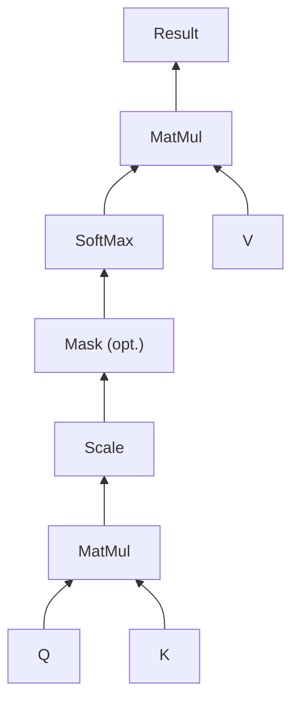

# 第三章：注意力机制

## Attention

NLP 神经网络模型的本质就是对输入文本进行编码，常规的做法是首先对句子进行分词，然后将每个词语 (token) 都转化为对应的词向量 (token embeddings)，这样文本就转换为一个由词语向量组成的矩阵 $\boldsymbol{X}=(\boldsymbol{x}_1,\boldsymbol{x}_2,\dots,\boldsymbol{x}_n)$，其中 $\boldsymbol{x}_i$ 是第 $i$ 个词语的词向量，维度为 $d$，故 $\boldsymbol{X}\in \mathbb{R}^{n\times d}$。

在 Transformer 模型提出之前，对 token 序列 $\boldsymbol{X}$ 的常规编码方式是通过循环网络 (RNNs) 和卷积网络 (CNNs)。

- RNN（例如 LSTM）的方案很简单，每一个词语 $\boldsymbol{x}_t$ 对应的编码结果 $\boldsymbol{y}_t$ 通过递归地计算得到：$\boldsymbol{y}_t =f(\boldsymbol{y}_{t-1},\boldsymbol{x}_t)$。RNN 的序列建模方式虽然与人类阅读类似，但是递归的结构导致其无法并行计算，因此速度较慢。而且 RNN 本质是一个马尔科夫决策过程，难以学习到全局的结构信息；
- CNN 则通过滑动窗口基于局部上下文来编码文本，例如核尺寸为 3 的卷积操作就是使用每一个词自身以及前一个和后一个词来生成嵌入式表示：$\boldsymbol{y}_t = f(\boldsymbol{x}_{t-1},\boldsymbol{x}_t,\boldsymbol{x}_{t+1})$。CNN 能够并行地计算，因此速度很快，但是由于是通过窗口来进行编码，所以更侧重于捕获局部信息，难以建模长距离的语义依赖。

Google《Attention is All You Need》提供了第三个方案：**直接使用 Attention 机制编码整个文本**。相比 RNN 要逐步递归才能获得全局信息（因此一般使用双向 RNN），而 CNN 实际只能获取局部信息，需要通过层叠来增大感受野，Attention 机制一步到位获取了全局信息：$\boldsymbol{y}_t = f(\boldsymbol{x}_t,\boldsymbol{A},\boldsymbol{B})$。其中 $\boldsymbol{A},\boldsymbol{B}$ 是另外的词语序列（矩阵），如果取 $\boldsymbol{A}=\boldsymbol{B}=\boldsymbol{X}$ 就称为 Self-Attention，即直接将 $\boldsymbol{x}_t$ 与自身序列中的每个词语进行比较，最后算出 $\boldsymbol{y}_t$。

| 模型 | 并行计算 | 长距离依赖 | 优点 | 缺点 |
| --- | --- | --- | --- | --- |
| RNN | 🔴 | 🟢 | 递归结构，类似人类阅读 | 无法并行计算，难以学习全局结构 |
| CNN | 🟢 | 🔴 | 并行计算 | 局部信息，难以建模长距离依赖 |
| Self-Attention | 🟢 | 🟢 | 一步到位获取全局信息 | 计算复杂度高，需要大量的计算资源 |

## Scaled Dot-product Attention

Scaled Dot-product Attention 共包含 2 个主要步骤：

1. **计算注意力权重**：使用某种相似度函数度量每一个 query 向量和所有 key 向量之间的关联程度。对于长度为 $m$ 的 Query 序列和长度为 $n$ 的 Key 序列，该步骤会生成一个尺寸为 $m \times n$ 的注意力分数矩阵。

    特别地，Scaled Dot-product Attention 使用点积作为相似度函数，这样相似的 queries 和 keys 会具有较大的点积。

    由于点积可以产生任意大的数字，这会破坏训练过程的稳定性。因此注意力分数还需要乘以一个缩放因子来标准化它们的方差，然后用一个 softmax 标准化。这样就得到了最终的注意力权重 $w_{ij}$，表示第 $i$ 个 query 向量与第 $j$ 个 key 向量之间的关联程度。

2. **更新 token embeddings**：将权重 $w_{ij}$ 与对应的 value 向量 $\boldsymbol{v}_1,…,\boldsymbol{v}_n$ 相乘以获得第 $i$ 个 query 向量更新后的语义表示 $\boldsymbol{x}_i’ = \sum_{j} w_{ij}\boldsymbol{v}_j$。

形式化表示为：

$$
\text{Attention}(\boldsymbol{Q},\boldsymbol{K},\boldsymbol{V}) = \text{softmax}\left(\frac{\boldsymbol{Q}\boldsymbol{K}^{\top}}{\sqrt{d_k}}\right)\boldsymbol{V} \tag{4}
$$

其中 $\boldsymbol{Q}\in\mathbb{R}^{m\times d_k}, \boldsymbol{K}\in\mathbb{R}^{n\times d_k}, \boldsymbol{V}\in\mathbb{R}^{n\times d_v}$ 分别是 query、key、value 向量序列。如果忽略 softmax 激活函数，实际上它就是三个 $m\times d_k,d_k\times n, n\times d_v$ 矩阵相乘，得到一个 $m\times d_v$ 的矩阵，也就是将 $m\times d_k$ 的序列 $\boldsymbol{Q}$ 编码成了一个新的 $m\times d_v$ 的序列。

将上面的公式拆开来看更加清楚：

$$
\text{Attention}(\boldsymbol{q}_t,\boldsymbol{K},\boldsymbol{V}) = \sum_{s=1}^n \frac{1}{Z}\exp\left(\frac{\langle\boldsymbol{q}_t, \boldsymbol{k}_s\rangle}{\sqrt{d_k}}\right)\boldsymbol{v}_s \tag{5}
$$

其中 $Z$ 是归一化因子，$\boldsymbol{K},\boldsymbol{V}$ 是一一对应的 key 和 value 向量序列，Scaled Dot-product Attention 就是通过 $\boldsymbol{q}_t$ 这个 query 与各个 $\boldsymbol{k}_s$ 内积并 softmax 的方式来得到 $\boldsymbol{q}_t$ 与各个 $\boldsymbol{v}_s$ 的相似度，然后加权求和，得到一个 $d_v$ 维的向量。其中因子 $\sqrt{d_k}$ 起到调节作用，使得内积不至于太大。
